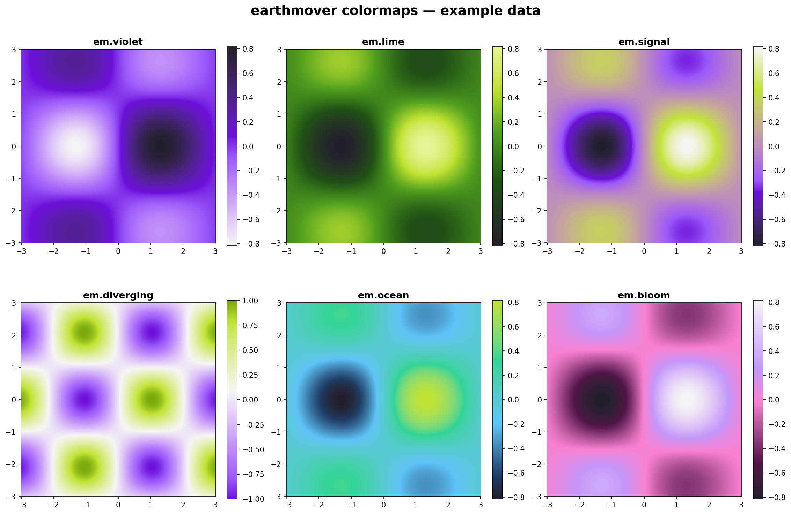
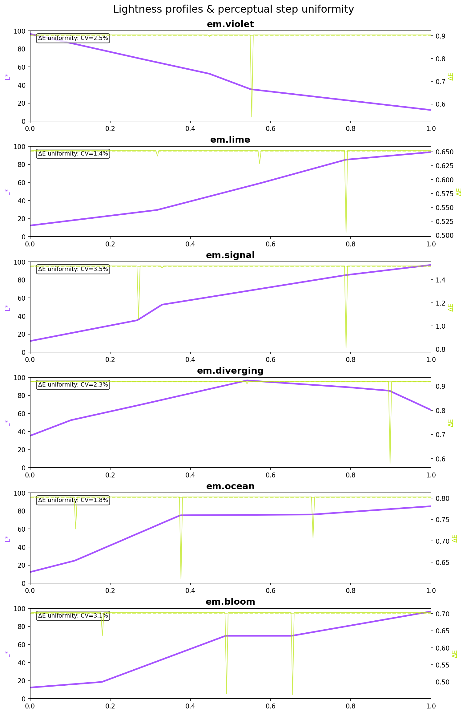

# earthmover-colormaps

Perceptually uniform colormaps built from the [Earthmover](https://earthmover.io) brand palette. Designed for scientific visualization — monotonic lightness, colorblind-safe, and zero required dependencies.


## Install

```bash
uv add earthmover-colormaps
```

Or with pip:

```bash
pip install earthmover-colormaps
```

Or from source:

```bash
uv add git+https://github.com/earth-mover/earthmover-colormaps.git
```

## Quick start

```python
import earthmover_colormaps  # registers colormaps with matplotlib on import
import matplotlib.pyplot as plt
import numpy as np

data = np.random.randn(100, 100)
plt.imshow(data, cmap="em.signal")
plt.colorbar()
plt.show()
```

That's it. `import earthmover_colormaps` registers all colormaps with matplotlib's global registry. Use them anywhere a colormap string is accepted — `plt.imshow`, `plt.pcolormesh`, `xarray.plot()`, `cartopy`, etc.

## Colormaps

| Name | Type | Description |
|------|------|-------------|
| `em.violet` | Sequential | Light grey → violet → midnight. Single-hue purple family. |
| `em.lime` | Sequential | Midnight → green → lime. Ideal for concentrations. |
| `em.signal` | Sequential | Midnight → violet → lime → light grey. The signature Earthmover axis. |
| `em.diverging` | Diverging | Violet ↔ light grey ↔ lime. Centered neutral for anomalies. |
| `em.ocean` | Sequential | Midnight → blue → green → lime. Cool multi-hue, oceanographic. |
| `em.bloom` | Sequential | Midnight → magenta → pink → lavender → light grey. Warm pink family. |

Every colormap has a reversed variant (append `_r`): `"em.signal_r"`, `"em.violet_r"`, etc.



## Access patterns

```python
import earthmover_colormaps

# 1. String name (after import registers them with matplotlib)
plt.imshow(data, cmap="em.signal")

# 2. Attribute access (short name, no "em." prefix)
earthmover_colormaps.signal
earthmover_colormaps.diverging

# 3. Dict access (full name)
earthmover_colormaps.cm["em.signal"]
earthmover_colormaps.cm["em.signal_r"]
```

## Integration with xarray

```python
import earthmover_colormaps
import xarray as xr

ds = xr.open_dataset("temperature.nc")
ds.temperature.plot(cmap="em.signal")
```

## Integration with cartopy

```python
import earthmover_colormaps
import cartopy.crs as ccrs
import matplotlib.pyplot as plt

fig, ax = plt.subplots(subplot_kw={"projection": ccrs.Robinson()})
ax.coastlines()
cs = ax.pcolormesh(lon, lat, sst, cmap="em.ocean", transform=ccrs.PlateCarree())
fig.colorbar(cs, ax=ax)
```

## Setting as default

To use an Earthmover colormap as your default across all plots:

```python
import earthmover_colormaps
import matplotlib as mpl

mpl.rcParams["image.cmap"] = "em.signal"
```

Or in a matplotlibrc file:

```
image.cmap: em.signal
```

## Design principles

All colormaps are designed with:

- **Perceptual uniformity** — interpolated in CIELAB color space with arc-length parameterization, so equal data steps produce equal visual steps (all have ΔE coefficient of variation < 4%)
- **Monotonic lightness** — sequential maps go strictly light-to-dark or dark-to-light; diverging maps have a V-shaped lightness profile. This means they print well in grayscale
- **Colorblind safety** — tested under simulated deuteranopia and protanopia at full severity. See [docs/colorblind-accessibility.md](docs/colorblind-accessibility.md)
- **Brand coherence** — derived from the Earthmover brand palette (Midnight `#201F2C`, Violet `#A653FF`, Lime `#B7E400`)



## Dependencies

**Zero required dependencies.** The RGB lookup tables are inlined as plain Python lists. matplotlib is only needed at registration time (when you `import earthmover_colormaps`). If you only need the raw RGB data:

```python
from earthmover_colormaps._data import COLORMAPS

# COLORMAPS["em.signal"] is a list of 256 [R, G, B] triples (0-1 floats)
```

## Development

```bash
git clone https://github.com/earth-mover/earthmover-colormaps.git
cd earthmover-colormaps
uv sync
uv run pytest
```

## License

Apache 2.0. See [LICENSE](LICENSE).
