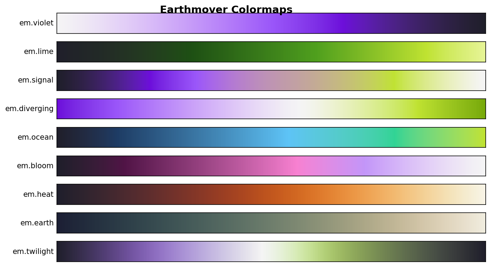
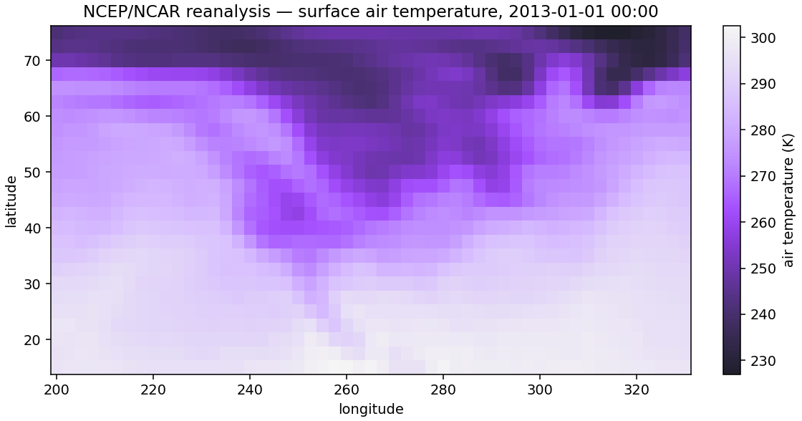

# earthmover-colormaps

Perceptually uniform colormaps built from the [Earthmover](https://earthmover.io) brand palette. Designed for scientific visualization — monotonic lightness, colorblind-safe, and zero required dependencies.



## Install

```bash
uv add earthmover-colormaps
```

Or with pip:

```bash
pip install earthmover-colormaps
```

Or from source:

```bash
uv add git+https://github.com/earth-mover/earthmover-colormaps.git
```

## Quick start

```python
import earthmover_colormaps  # registers colormaps with matplotlib on import
import xarray as xr

ds = xr.tutorial.open_dataset("air_temperature")
ds.air.isel(time=0).plot(cmap="em.bloom")
```



`import earthmover_colormaps` registers everything with matplotlib's global registry, so the names work anywhere a `cmap=` argument is accepted (`plt.imshow`, `plt.pcolormesh`, `xarray.plot()`, `cartopy`, …).

## Colormaps

| Name | Type |
|------|------|
| `em.violet` | Sequential |
| `em.lime` | Sequential |
| `em.signal` | Sequential |
| `em.diverging` | Diverging |
| `em.ocean` | Sequential |
| `em.bloom` | Sequential |
| `em.cycle` | Cyclic |

Every colormap has a reversed variant (append `_r`): `"em.signal_r"`, `"em.violet_r"`, etc.

## Access patterns

```python
import earthmover_colormaps

# 1. String name (after import registers them with matplotlib)
plt.imshow(data, cmap="em.signal")

# 2. Attribute access (short name, no "em." prefix)
earthmover_colormaps.signal
earthmover_colormaps.diverging
earthmover_colormaps.bloom

# 3. Dict access (full name)
earthmover_colormaps.cm["em.signal"]
earthmover_colormaps.cm["em.signal_r"]
```

## Setting as default

To use an Earthmover colormap as your default across all plots:

```python
import earthmover_colormaps
import matplotlib as mpl

mpl.rcParams["image.cmap"] = "em.signal"
```

Or in a matplotlibrc file:

```
image.cmap: em.signal
```

## Design

Linear J' lightness in CAM02-UCS, gamut-clipped chroma, validated under simulated deuteranopia / protanopia / tritanopia.

To inspect any map (or compare against a matplotlib builtin):

```bash
uv run --group design python tools/compare_gui.py
```

## Releasing

Versions come from git tags via `hatch-vcs` — no edits to `pyproject.toml`. To cut a release:

```bash
git tag v0.2.0
git push origin v0.2.0
gh release create v0.2.0 --generate-notes
```

Publishing the GitHub release fires [`.github/workflows/publish.yml`](.github/workflows/publish.yml), which builds and uploads to PyPI via OIDC trusted publishing.

## License

Apache 2.0. See [LICENSE](LICENSE).
