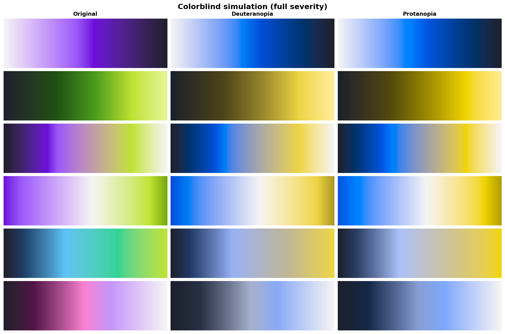

# Colorblind accessibility

All Earthmover colormaps are designed to be readable by people with color vision deficiencies (CVD). This document describes the design approach, testing methodology, and results.

## Design approach

The primary defense against colorblind inaccessibility is **monotonic lightness**. Regardless of how hues are perceived, a map that goes steadily from light to dark (or vice versa) will always convey data magnitude correctly. Every sequential Earthmover colormap has a strictly monotonic L\* (CIELAB lightness) profile, and the diverging map has a symmetric V-shaped profile.

This is the same principle behind matplotlib's `viridis` and the cmocean colormaps.

## Simulation methodology

Colormaps were tested using the Brettel/Vienot (1999) simulation matrices at **full severity** (100%), representing complete dichromacy — the most extreme form of color vision deficiency. The three simulated conditions are:

| Condition | Affects | Prevalence |
|-----------|---------|------------|
| **Deuteranopia** | Green cone (M-cone) absent | ~1% of males |
| **Protanopia** | Red cone (L-cone) absent | ~1% of males |
| **Tritanopia** | Blue cone (S-cone) absent | ~0.003% of population |

Deuteranopia and protanopia (red-green color blindness) account for ~99% of CVD cases, so these were the primary focus.

## Results

### Summary by colormap

**em.violet** (sequential, single-hue)
- Deuteranopia: Shifts to a blue-white gradient. Lightness gradient fully preserved.
- Protanopia: Shifts to a blue-white gradient. Lightness gradient fully preserved.
- Assessment: **Excellent.** Single-hue maps degrade gracefully under CVD since there's no hue contrast to lose.

**em.lime** (sequential, green family)
- Deuteranopia: Shifts to dark → golden yellow gradient. Lightness gradient preserved.
- Protanopia: Shifts to dark → blue-white gradient. Lightness gradient preserved.
- Assessment: **Excellent.** The lightness ramp carries all the information.

**em.signal** (sequential, violet → lime)
- Deuteranopia: Shifts to dark blue → light blue → golden → white. The violet-lime hue transition becomes blue-yellow, which is well-separated.
- Protanopia: Shifts to dark blue → light grey → yellow → white. Clear gradation maintained.
- Assessment: **Very good.** The large lightness range (L\* 12–97) ensures readability. Under CVD, the violet↔lime hue axis maps onto the blue↔yellow axis, which is the most discriminable axis for dichromats.

**em.diverging** (diverging, violet ↔ grey ↔ lime)
- Deuteranopia: Becomes blue ↔ light ↔ yellow. The neutral center is preserved, and both arms remain visually distinct.
- Protanopia: Becomes blue ↔ light ↔ yellow. Same positive result.
- Assessment: **Excellent.** The violet↔lime axis is ideal for a colorblind-safe diverging map because it maps onto blue↔yellow under both forms of red-green CVD. This is superior to the common red↔blue diverging maps which collapse under protanopia.

**em.ocean** (sequential, cool multi-hue)
- Deuteranopia: Shifts to dark → blue → green-gold → yellow. Maintains a clear multi-step gradient.
- Protanopia: Shifts to dark → blue → light → golden. Some hue compression in the middle, but lightness carries the signal.
- Assessment: **Good.** The monotonic lightness ensures readability, though some of the blue↔green hue variation is compressed.

**em.bloom** (sequential, pink family)
- Deuteranopia: Shifts to dark → blue → light blue → white. Clean lightness ramp.
- Protanopia: Shifts to dark → blue-grey → light grey → white. Less saturated but fully readable.
- Assessment: **Excellent.** Like em.violet, the near-single-hue path means CVD simulation simply desaturates or shifts hue without disrupting the lightness gradient.

## Perceptual uniformity metrics

Perceptual uniformity is quantified using the coefficient of variation (CV) of the step-wise ΔE (CIELAB color difference between consecutive colors in the 256-entry lookup table). Lower CV means more uniform steps.

| Colormap | L\* range | Mean ΔE | CV |
|----------|----------|---------|-----|
| em.violet | 12–97 | 0.90 | 2.5% |
| em.lime | 12–94 | 0.65 | 1.4% |
| em.signal | 12–97 | 1.51 | 3.5% |
| em.diverging | 35–97 | 0.92 | 2.3% |
| em.ocean | 12–85 | 0.80 | 1.8% |
| em.bloom | 12–97 | 0.70 | 3.1% |

For comparison, matplotlib's `viridis` has a CV of approximately 2–3%. All Earthmover colormaps are within this range.

## Recommendations

For maximum accessibility:

1. **Use `em.signal` or `em.diverging` as defaults.** The violet↔lime axis maps onto blue↔yellow under CVD — the most distinguishable pair for dichromats.
2. **Add contour lines or hatching** when colorblind safety is critical and data has fine structure.
3. **Avoid encoding information in hue alone.** The monotonic lightness of these colormaps means they work in grayscale too — test by printing in black and white.

## References

- Brettel, H., Viénot, F., & Mollon, J. D. (1997). Computerized simulation of color appearance for dichromats. *JOSA A*, 14(10), 2647–2655.
- Kovesi, P. (2015). Good colour maps: How to design them. *arXiv:1509.03700*.
- Crameri, F., Shephard, G. E., & Heron, P. J. (2020). The misuse of colour in science communication. *Nature Communications*, 11, 5444.
